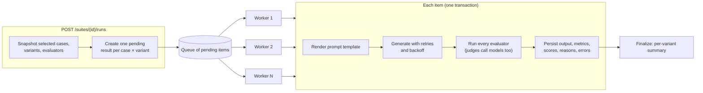
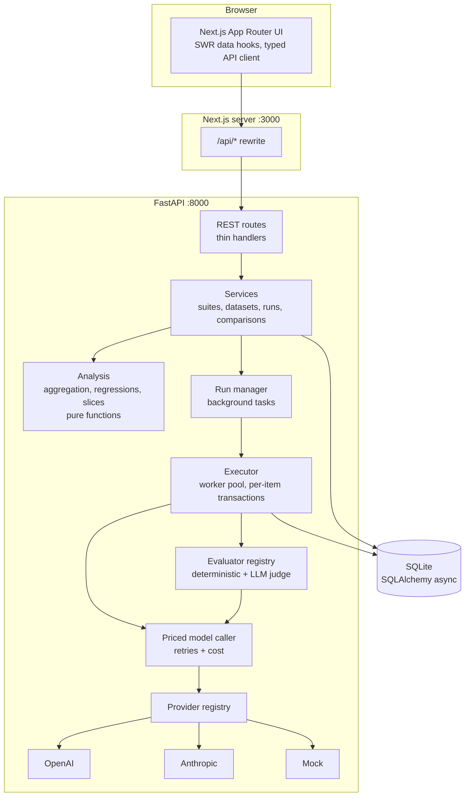
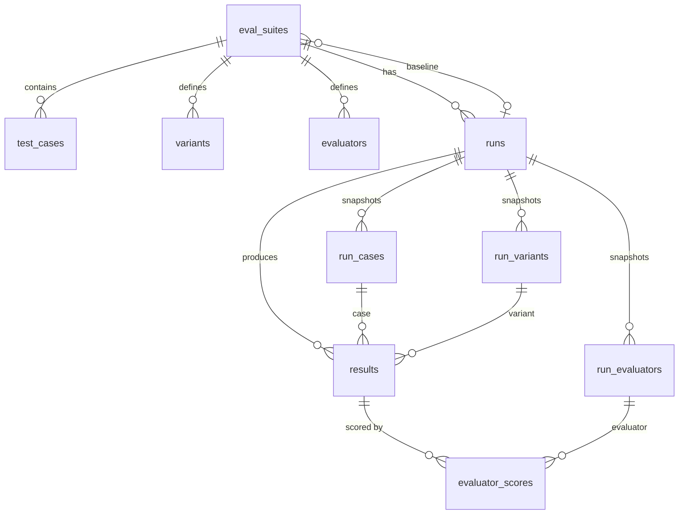

# Eval Harness

A local-first evaluation platform for LLM-backed features. Define a dataset, describe the prompt
and model variants you want to compare, score every output with deterministic checks and
LLM judges, and see exactly which cases got better or worse.

> **When I change my prompt, model, or LLM pipeline, did I actually make the feature better?**

Eval Harness answers that question at the level where it matters: per test case, per
evaluator, per slice of the dataset, alongside latency, token usage, and estimated cost.

---

## Contents

- [The problem](#the-problem)
- [Features](#features)
- [Quick start](#quick-start)
- [Environment variables](#environment-variables)
- [How an evaluation run works](#how-an-evaluation-run-works)
- [Scoring, baselines, and regressions](#scoring-baselines-and-regressions)
- [Evaluator types](#evaluator-types)
- [Providers and cost](#providers-and-cost)
- [Architecture](#architecture)
- [Project structure](#project-structure)
- [API overview](#api-overview)
- [Testing and quality checks](#testing-and-quality-checks)
- [V1 limitations](#v1-limitations)
- [Planned V2 directions](#planned-v2-directions)

## The problem

Prompt and model changes are usually judged by eyeballing a handful of outputs. That misses the
failure modes that actually hurt:

- an aggregate score improves while an important subset (hard questions, a customer segment,
  long documents) quietly gets worse;
- a new prompt fixes formatting but loses factual accuracy;
- a cheaper model looks fine on average but fails the cases you care about;
- a "better" variant doubles latency or cost.

Eval Harness runs the same dataset through every variant, scores each output with the same
evaluators, persists everything, and compares arms case by case against a baseline.

## Features

- **Evaluation suites** holding a dataset, variants, evaluators, and run history.
- **Datasets** with string or structured JSON inputs and expected outputs, tags, and metadata;
  create and edit in the UI or import JSON / JSON Lines with validation and preview.
- **Variants**: provider, model, system prompt, `{{ field }}` user template, temperature,
  max tokens, and provider-specific settings.
- **Providers**: OpenAI, Anthropic, and a deterministic **mock provider** for development,
  demos, and tests (no API key, no cost).
- **Deterministic evaluators**: exact match, contains, regex, valid JSON, JSON Schema,
  required fields, and field-level structured comparison with numeric tolerance.
- **LLM-as-a-judge** evaluators with a custom rubric, judge provider and model, score range,
  pass threshold, and a required written reason for every score.
- **Batch runs** with bounded concurrency, retries with exponential backoff, per-generation and
  per-evaluator error states, live progress, cancel, and resume.
- **Operational metrics**: latency (mean, p50, p95), input/output tokens, estimated cost for
  generations and judges, retry counts.
- **Run history** with full configuration snapshots, so old runs stay interpretable after you
  edit or delete variants, evaluators, or test cases.
- **Comparison dashboard**: overall and per-evaluator deltas, improved / unchanged / regressed
  counts, cost and latency deltas, and warnings when a headline improvement hides a
  regression.
- **Sliced analysis** by tag, on the overall score or on any single evaluator.
- **Baselines and regression detection** at the case × evaluator level with per-evaluator
  thresholds.
- **Case inspector**: input, reference, both outputs side by side, every evaluator's score and
  reason, latency, tokens, cost, retries, errors, and the exact rendered prompts.
- Two **seeded example suites** (Research QA and Structured Extraction) with real run history,
  so the app never opens empty.

## Quick start

Requirements: Python 3.11+ with [uv](https://docs.astral.sh/uv/), and Node.js 22+.

```bash
# 1. Backend (http://localhost:8000, API docs at /docs)
cd backend
uv sync
uv run uvicorn app.main:app --reload --port 8000
```

```bash
# 2. Frontend (http://localhost:3000)
cd frontend
npm install
npm run dev
```

Open <http://localhost:3000>. On first start the backend creates `backend/data/eval_harness.db`
and seeds two example suites, each with a baseline run and a candidate run executed against the
mock provider. Everything works offline; add API keys to also run real models.

To start over, stop the backend and delete `backend/data/`.

<details>
<summary>Without uv</summary>

```bash
cd backend
python -m venv .venv && source .venv/bin/activate
pip install fastapi "uvicorn[standard]" pydantic pydantic-settings "sqlalchemy[asyncio]" \
  aiosqlite jsonschema openai "anthropic>=1,<2"
uvicorn app.main:app --reload --port 8000
```
</details>

### A five-minute tour

1. **Suites** → *Research QA*. The overview shows the best variant in the latest run and its
   delta against the baseline.
2. **Dataset**: browse, filter by tag, edit a case, or import `docs/examples/support-answers.json`.
3. **Variants** and **Evaluators**: inspect or edit prompts, models, rubrics, and thresholds.
4. **Run evaluation**: choose variants, evaluators, and optionally tags; watch progress live.
5. **Run results**: pick a reference and a candidate. Try *Grounded + cited · prompt v2*
   against the baseline: the overall score rises by 36 points, but the verdict warns that
   **Correctness fell**, and slicing by *Correctness* shows the `people` and `operations`
   slices regressed.
6. Click **Regressed**, open a case, and read the judge's reasons side by side. Use `j` / `k`
   to move through the filtered cases.
7. **Set as baseline** on a run to make it the reference for future runs.

## Environment variables

Copy `.env.example` to `backend/.env` (or export the variables). Secrets are read from the
environment only and never stored in the database.

| Variable | Default | Purpose |
|---|---|---|
| `OPENAI_API_KEY` | unset | Enables the OpenAI provider. |
| `ANTHROPIC_API_KEY` | unset | Enables the Anthropic provider. |
| `EVAL_HARNESS_DATABASE_URL` | `sqlite+aiosqlite:///data/eval_harness.db` (relative to `backend/`) | SQLAlchemy async URL. |
| `EVAL_HARNESS_PRICING_FILE` | `backend/pricing.json` | Per-model token prices for cost estimates. |
| `EVAL_HARNESS_SEED_EXAMPLES` | `true` | Seed example suites into an empty database. |
| `EVAL_HARNESS_DEFAULT_CONCURRENCY` | `4` | Concurrency used when a run does not specify one. |
| `EVAL_HARNESS_MAX_CONCURRENCY` | `32` | Upper bound accepted for a run. |
| `EVAL_HARNESS_REQUEST_TIMEOUT` | `60` | Seconds per provider request. |
| `EVAL_HARNESS_MOCK_LATENCY_SCALE` | `1.0` | Multiplier on the mock's simulated latency (0 = instant). |
| `EVAL_HARNESS_CORS_ORIGINS` | `["http://localhost:3000"]` | Origins allowed to call the API directly. |
| `EVAL_HARNESS_API_URL` (frontend) | `http://127.0.0.1:8000` | Where the Next.js server proxies `/api/*`. |

Without keys, the OpenAI and Anthropic providers show as unconfigured in the sidebar; variants
using them are disabled in the run form, and the API rejects runs that need them with a message
naming the missing variable.

## How an evaluation run works



1. **Snapshot.** Launching a run copies the selected test cases, the full variant configuration
   (provider, model, prompts, temperature, settings), and every evaluator's configuration into
   `run_cases`, `run_variants`, and `run_evaluators`. Results reference only these snapshots.
   The run also records execution metadata: app and Python versions, concurrency, retry policy,
   the case selection, and the pricing entries in effect.
2. **Plan.** One `results` row is created per (case, variant) pair, all `pending`. A unique
   constraint on the pair means an item can never be generated twice.
3. **Execute.** A fixed pool of `concurrency` workers drains the queue. Each worker renders the
   prompt, calls the provider through a retrying, pricing-aware model caller, runs every
   evaluator on the output, and commits the item in one transaction. Judges run inside the
   worker's slot, so at most `concurrency` model requests are ever in flight.
4. **Retries.** Rate limits, timeouts, connection errors, and 5xx responses are retried with
   capped exponential backoff and full jitter (honouring `Retry-After`). Bad requests, auth
   failures, refusals, and template errors fail immediately. Attempts are recorded per item.
   Provider SDK retries are disabled so every attempt is counted exactly once.
5. **Partial failure.** A failed generation marks that item `failed` with its error kind and
   message, and its evaluators `skipped`; an evaluator that errors (for example a judge that
   returns malformed JSON) is recorded as `failed` for that score only. The run continues.
6. **Progress** is simply the count of terminal result rows; the UI polls once per second while
   a run is active.
7. **Cancel, crash, resume.** Cancelling marks remaining items `cancelled`. On startup, runs left
   `running` by a previous process are marked `interrupted`. **Resume** re-queues only
   unfinished items (optionally failed ones too); completed generations are never requested
   again.
8. **Finalize.** Per-variant summaries are computed and cached on the run for list views; the
   comparison endpoints recompute from persisted results on demand.

## Scoring, baselines, and regressions

**Scores.** Every evaluator result has `score` (normalised to 0–1 when present), `passed`,
`reason`, and `details`. Binary checks store 1.0/0.0 so they aggregate naturally, but the UI
shows them as pass/fail. LLM judges return a raw score on their configured range (for example
1–5), which is normalised; pass/fail is decided locally from the normalised score and the
evaluator's threshold, so thresholds can change without re-running anything.

**Aggregation** (per arm, i.e. one variant within one run):

- *Case score*: the mean of that case's successful evaluator scores.
- *Overall score*: the mean case score. Each case counts equally.
- *Pass rate*: the share of scored cases where every evaluator passed.
- Failed generations are excluded from quality averages and reported as errors, so a flaky
  provider shows up as an error count rather than silently lowering quality. Evaluator errors
  are excluded from that evaluator's mean and counted separately.

**Comparing two arms.** Arms are paired on shared test cases (by the source test-case id), and
evaluators by their source id, so a baseline from last week compares cleanly with today's
candidate. Aggregates in a comparison use only the shared cases, and the dashboard reports any
cases present on only one side.

**Regression rule**, per case × evaluator, with a configurable threshold per evaluator
(default 0.05 on the 0–1 scale):

| Outcome | Rule |
|---|---|
| regressed | the score dropped by more than the threshold, **or** the verdict flipped from pass to fail |
| improved | the score rose by more than the threshold, **or** the verdict flipped from fail to pass |
| unchanged | within the threshold, same verdict |
| not comparable | either side has no usable score (generation or evaluator failed) |

A case is *regressed* if any of its evaluators regressed (flagged *mixed* if others improved),
*improved* if at least one improved and none regressed, and *unchanged* otherwise. Generation
failures never count as regressions or improvements; they are surfaced separately so a
transient outage cannot masquerade as a quality change.

```text
case_017   Correctness   baseline 0.92   candidate 0.61   Δ −0.31   REGRESSED
```

**Baselines.** Any completed run can be marked as the suite's baseline (choosing which variant
when the run has several). The dashboard defaults to comparing the run's last variant against
the baseline, and suite summaries show the latest best score's delta from it.

**Slices.** For every tag, the slice score is the mean case score over cases with that tag
(cases can be in several slices). Slices can also be computed on a single evaluator's scores. A
slice is flagged *regressed* when it drops by more than 2 points, and as a **hidden
regression** when that happens while the overall score (or that evaluator's overall score)
held steady or improved. The verdict band also warns when an individual evaluator declined
while the overall score rose.

## Evaluator types

| Type | Checks | Scoring | Notable options |
|---|---|---|---|
| `exact_match` | Output (or one JSON field of it) equals the expected value | pass/fail | `expected_path`, `output_path`, `case_sensitive`, `collapse_whitespace` |
| `contains` | Output contains fixed strings and/or expected values | fraction found | `values`, `expected_path`, `mode` (all/any), `case_sensitive` |
| `regex` | Output matches, or must not match, a pattern | pass/fail | `pattern`, `should_match`, flags |
| `json_valid` | Output parses as JSON | pass/fail | `allow_code_fence` |
| `json_schema` | Output conforms to a JSON Schema (draft 2020-12) | pass/fail | `json_schema`; violations listed in details |
| `required_fields` | Output JSON contains every listed path | fraction present | `fields`, `allow_null` |
| `field_match` | Field-by-field comparison with the expected object | fraction matched | `fields`, `numeric_tolerance`, `pass_threshold` |
| `llm_judge` | A model grades the output against a rubric | graded 0–1 | `provider`, `model`, `criteria`, `score_min`/`score_max`, `pass_threshold`, `include_input`, `include_expected` |

The judge is asked for `{"reason": string, "score": number}` using the provider's structured
output mode (OpenAI `json_schema` response format, Anthropic `output_config.format`), and the
response is validated again locally. A missing or empty reason, a malformed response, or an
out-of-range score is an evaluator error rather than a silent zero.

**Adding an evaluator type** takes a Pydantic config model, a class with
`async def evaluate(sample) -> EvaluatorOutcome`, and one entry in
`backend/app/evaluators/registry.py`. Configs are validated by the registry before they are
stored, and the UI form is described in `frontend/src/lib/evaluator-forms.ts`.

## Providers and cost

All model access goes through one protocol:

```python
class ModelProvider(Protocol):
    name: str
    async def generate(self, messages: list[Message], config: ModelConfig) -> GenerationResult: ...
```

`GenerationResult` carries the output, latency, input/output tokens, the model that answered,
the provider, and the finish reason. Adapters classify failures into a small set of error kinds
(`rate_limited`, `timeout`, `server_error`, `bad_request`, `auth`, `refusal`, …) that drive the
retry policy. Nothing outside `backend/app/providers/` knows a provider SDK exists.

- **OpenAI**: Chat Completions via the official SDK, JSON Schema structured outputs for judges.
- **Anthropic**: Messages API via the official SDK, `output_config.format` for judges.
  Sampling parameters are only sent when a variant sets them explicitly, because newer Claude
  models reject them.
- **Mock**: deterministic and offline. It answers numbered-passage QA, extracts company /
  revenue / year from messy text, and acts as a judge (key-fact recall against the reference or
  grounding against the input). Prompt wording genuinely changes its behaviour (citations,
  grounding, raw JSON), model names set a skill level, and settings can inject transient
  failures (`mock_failure_rate`) to exercise retries. Seeded runs, the dashboard demo, and most
  tests use it.

**Cost** is `input_tokens × input_price + output_tokens × output_price` using per-million-token
prices from `backend/pricing.json`. Each entry records its source and date; models without an
entry report no cost (shown as "—" and flagged as incomplete) instead of a guessed number.
Judge spend is tracked separately from generation spend. Edit the file to match your contract
pricing; each run records the prices it used.

## Architecture



**Domain model**



Design choices worth calling out:

- **Snapshots over references.** Historical results depend only on run snapshot tables.
  `run_cases.test_case_id` and `run_variants.variant_id` are plain identifiers (not foreign
  keys) so deleting a source case or variant never breaks old runs or cross-run pairing.
- **The database is the source of truth for run state.** The in-process run manager holds only
  asyncio tasks; progress, resume, and crash recovery all derive from result rows, so the
  manager could be replaced by a job queue without touching the executor.
- **Analytics are pure.** `backend/app/analysis/` operates on immutable records with no database
  or HTTP dependencies, which is where the evaluation methodology lives and is tested.
- **Portable persistence.** Plain SQLAlchemy 2.0 models with a naming convention and a JSON type
  that becomes JSONB on Postgres; switching databases is a URL change plus migrations.
- **Typed end to end.** Pydantic schemas define the API; the frontend's TypeScript types are
  generated from the OpenAPI document (`npm run gen:api`).

## Project structure

```text
eval-harness/
├── backend/
│   ├── app/
│   │   ├── main.py            # app factory, lifespan (DB, providers, run manager, seeding)
│   │   ├── config.py          # environment-driven settings
│   │   ├── pricing.py         # pricing table and cost estimation
│   │   ├── api/               # FastAPI routes, dependencies, error envelope
│   │   ├── schemas/           # Pydantic request/response models (the public contract)
│   │   ├── services/          # business logic: suites, datasets, runs, comparisons
│   │   ├── db/                # SQLAlchemy base, session, models
│   │   ├── domain/            # statuses and prompt templating
│   │   ├── providers/         # provider protocol, OpenAI, Anthropic, mock, registry
│   │   ├── evaluators/        # evaluator contract, deterministic checks, LLM judge, registry
│   │   ├── runner/            # retry policy, priced model caller, executor, run manager
│   │   ├── analysis/          # aggregation, regression detection, slices (pure)
│   │   └── seed/              # example suites (JSON) and the seeding routine
│   ├── tests/                 # pytest suite (unit + API integration)
│   └── pricing.json
├── frontend/
│   └── src/
│       ├── app/               # routes: suites, suite tabs, runs, run dashboard, case inspector
│       ├── components/        # ui primitives, compare dashboard, inspector, editors
│       └── lib/               # API client + generated types, SWR hooks, pure view logic
├── docs/
│   ├── dataset-format.md
│   └── examples/support-answers.json
└── .env.example
```

## API overview

Interactive documentation is served at <http://localhost:8000/docs>.

| Resource | Endpoints |
|---|---|
| Suites | `GET/POST /api/suites`, `GET/PATCH/DELETE /api/suites/{id}`, `PUT/DELETE /api/suites/{id}/baseline` |
| Test cases | `GET/POST /api/suites/{id}/test-cases`, `POST /api/suites/{id}/test-cases/import`, `GET/PATCH/DELETE /api/test-cases/{id}` |
| Variants | `GET/POST /api/suites/{id}/variants`, `PATCH/DELETE /api/variants/{id}` |
| Evaluators | `GET/POST /api/suites/{id}/evaluators`, `PATCH/DELETE /api/evaluators/{id}` |
| Runs | `GET /api/runs`, `GET/POST /api/suites/{id}/runs`, `GET/DELETE /api/runs/{id}`, `POST /api/runs/{id}/cancel`, `POST /api/runs/{id}/resume` |
| Analysis | `GET /api/compare?target=&base=&slice_evaluator=`, `GET /api/case-results?test_case_id=&arms=` |
| Discovery | `GET /api/providers`, `GET /api/evaluator-types`, `GET /api/health` |

Errors use one envelope: `{"error": {"code", "message", "details"}}`, with 404 for missing
resources, 409 for conflicts (duplicate names or keys, runs already executing), and 422 for
validation failures (including per-field details).

## Testing and quality checks

```bash
cd backend
uv run pytest            # 106 tests: evaluators, judge parsing, aggregation, regressions,
                         # slices, pricing, retries, adapters, runner, API workflows, seeding
uv run ruff check . && uv run ruff format --check .
uv run mypy app          # strict
```

```bash
cd frontend
npm test                 # Vitest: formatting, import parsing, run planning, comparison
                         # filters and sorting, dashboard components
npm run lint
npm run typecheck
npm run format:check
npm run build
```

Tests never call real providers: adapters are exercised against in-process HTTP transports,
and the runner is tested with scripted fake providers (flaky, broken, slow) plus the mock.

## V1 limitations

- **Single process.** Runs execute as asyncio tasks inside the API process. They survive a
  restart as *interrupted* and can be resumed, but there is no separate worker or queue.
- **SQLite and `create_all`.** No migration tooling yet; schema changes require recreating the
  database.
- **Polling, not streaming.** Progress updates once per second.
- **Single-turn prompts.** A variant is a system prompt plus one user template; no multi-turn
  conversations, tools, or retrieval pipelines.
- **Cost is an estimate** from a static price table (no cached-token or batch discounts).
- **No statistical significance testing**: deltas and thresholds are descriptive, which is
  easy to reason about but noisy on small datasets or non-zero temperatures.
- **No authentication**: intended for local, single-user use.
- JSON / JSON Lines import only; no CSV, dataset versioning, or result export yet.

## Planned V2 directions

Not implemented, but the architecture leaves room for them:

- **CLI and CI regression gates**: run a suite headlessly and fail a build when regressions
  exceed a budget (the services and analysis layers are already UI-independent).
- **Worker process / job queue** replacing the in-process run manager.
- **Alembic migrations and Postgres** (the models already use a JSONB variant).
- **Significance testing and repeated sampling** (bootstrap confidence intervals on deltas,
  multiple samples per case at non-zero temperature).
- **Pairwise judges and multiple judge models**, plus judge calibration against human labels.
- **Human annotation** and evaluator/human agreement metrics.
- **Dataset versioning, CSV import, and result export.**
- **Pipeline variants** (multi-step chains, RAG retrieval metrics, agent trajectories) behind the
  same variant abstraction.
- **Production trace ingestion** to turn real traffic into test cases.
